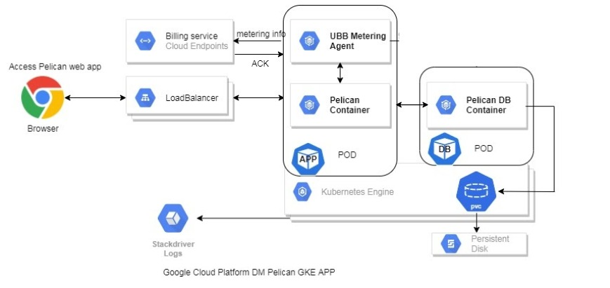
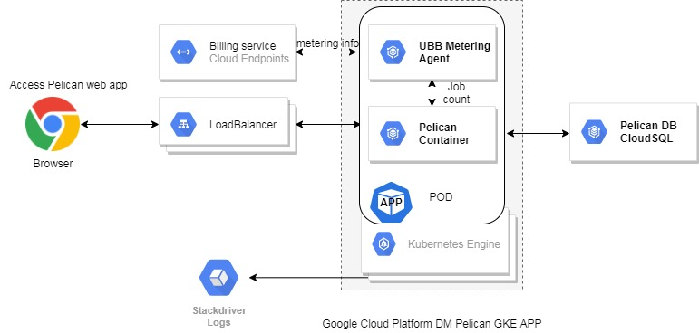

# Pelican integration with google cloud

## **OVERVIEW**

Datametica intends to bring its suite of products starting with the Pelican Data Verification product to the cloud marketplace. We have implemented support to launch and use Pelican over Kubernetes and can be integrated with GCP&#39;s GKE as a GKE app at marketplace.

## **DEPLOYMENT ARCHITECTURE**

Pelican can be deployed using helm charts on GKE and also intended to support on-prem GKE using Anthos. The Pelican app can be deployed with an option of choosing MySQL DB backend. Customers can choose as per their need either cloudSQL or Pelican MySQL DB POD. The deployment architecture will look like as below

**Option-A: Deploy Pelican app with standard mysql db pod and persistence disk**

**Option-B: Deploy Pelican app with cloudSQL DB instance**

The Pelican tightly integrates with GKE as shown in above architecture diagram and accelerates the data validation process between source and destination data bases and performs automated data validations.

Kubernetes manages Pelican single-instance solutions and the Pelican UI endpoints by default exposed externally using a LoadBalancer Service on a single port 80 - for HTTP interface. The MySQL DB is exposing the service on port 3306 internally to pelican POD.

The sizing and configuration can be customized and managed using ConfigMaps and Helm chart values.yml

The Pelican GKE version adapts custom pricing model and strategy is charged by datametica, billed by google model. Here we have integrated the usage based billing agent as a side-car container with Pelican app for usage metering.

## **INSTALLATION**

Upon launching the Pelican GKE app on the marketplace, the installation would be with a few clicks from the marketplace launch page. One can also perform the manual deployment using following command line instructions.

### **COMMAND-LINE INSTRUCTIONS**

### **PRE-REQUISITES**

You&#39;ll need the following tools in your development environment:

- [gcloud](https://cloud.google.com/sdk/gcloud/)
- [kubectl](https://kubernetes.io/docs/reference/kubectl/overview/)
- [docker](https://docs.docker.com/install/)
- [git](https://git-scm.com/book/en/v2/Getting-Started-Installing-Git)
- [openssl](https://www.openssl.org/)
- h[elm](https://helm.sh/)

### **DEPLOYMENTS**

**Configure gcloud as a Docker credential helper** :

gcloud auth configure-docker

**Create a Google Kubernetes Engine (GKE) cluster:**

**Create a new cluster from the command-line:**

export CLUSTER=pelican-cluster

export ZONE=us-cebtral1-a

gcloud container clusters create &quot;${CLUSTER}&quot; --zone &quot;${ZONE}&quot;

**Configure kubectl to connect to the new cluster:**

gcloud container clusters get-credentials &quot;${CLUSTER}&quot; --zone &quot;${ZONE}&quot;

**Clone this repo [TBD]**

Clone this repo, as well as its associated tools repo:

git clone --recursive https://github.com/datametica/pelican-gke-deploy.git

**Install the Pelican app**

cd pelican-gke-deploy

Configure the variables from values.yml such as namespace, image, image tag, ingress settings, persistence disk size and execute below command

kubectl create namespace &quot;${NAMESPACE}&quot;

kubectl apply -f helm-rbac.yaml

helm init --service-account=tiller

helm install --name pelican .

## CloudSQL deployment steps

Start the installation with gcloud command with following steps:

1. Create a CloudSQL instance

gcloud sql instances create [INSTANCE\_NAME] \

--tier=[MACHINE\_TYPE] \

--region=[REGION] \

--database-version MYSQL\_5\_7 \

--network=[Pelican GKE CLUSTER NETWORK] \

--authorized-networks=[0.0.0.0/0]

Where you can mention

INSTANCE\_NAME as pelican-db

MACHINE\_TYPE recommended is db-n1-standard-1 or higher

REGION should be the pelican GKE cluster region

Authorized network choose all open if the instance is set with public ip

1. Set the root password

gcloud sql users set-password root --host=% --instance [INSTANCE\_NAME] --password [PASSWORD]

1. Setup the pelican database user, execute following command

gcloud sql users create [USER\_NAME] --host=% --instance=[INSTANCE\_NAME] --password=[USER\_PASSWORD]

This username and password are required at the time of pelican helm chart deployments

1. Create and load pelican db, you can also perform this by using standard mysql client

gcloud sql databases create ecat\_pelican\_db --instance=[INSTANCE\_NAME]

--charset=utf8 --collation=utf8\_general\_ci

1. Load the ecat\_pelican\_db data dump into database

gcloud sql import sql [INSTANCE URI] --database=ecat\_pelican\_db --user=[USER\_NAME]

Where

INSTANCE URI is cloudsql instance id

USER\_NAME is above step 3 created username

1. Use this configured CloudSQL DB instance IP/URL as Pelican DB URL while deploying Pelican app using helm charts

Ref: [https://cloud.google.com/sql/docs/mysql/quickstart](https://cloud.google.com/sql/docs/mysql/quickstart)

[https://cloud.google.com/sql/docs/mysql/create-instance](https://cloud.google.com/sql/docs/mysql/create-instance)

## Access Pelican application URL

The GKE deployment will create ingress Load balancer and using its URL/IP access the Pelican application.
