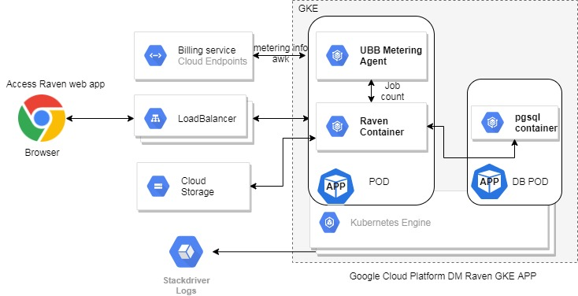

# Raven integration with google cloud

## **OVERVIEW**

Datametica intends to bring its suite of products starting with the Raven query translation and validation product to the cloud marketplace. We have implemented support to launch and use Raven over Kubernetes and can be integrated with GCP&#39;s GKE as a GKE app at marketplace.

## **DEPLOYMENT ARCHITECTURE**

Raven can be deployed using helm charts on GKE and also intended to support on-prem GKE using Anthos. The deployment architecture will look like as below

The Raven tightly integrates with GKE as shown in above architecture diagram and accelerates the data translation process between source and destination data bases and performs automated data validations (for BigQuery translation only). For data persistence the application will sync the translated job details data with customer provided google storage bucket.

Kubernetes manages Raven single-instance solutions and the Raven UI endpoints by default exposed externally using a LoadBalancer Service on a single port 8080 or 8443 - for HTTP and HTTPS interface.

The sizing and configuration can be customized and managed using ConfigMaps and Helm chart values.yml

The Raven GKE version adapts a custom pricing model and strategy is charged by datametica, billed by google. Here we have integrated the usage based billing agent as a side-car container with Raven app for usage metering.

## **INSTALLATION**

Upon launching the Raven GKE app on the marketplace, the installation would be with a few clicks from the marketplace launch page. One can also perform the manual deployment using following command line instructions.

### **COMMAND-LINE INSTRUCTIONS**

### **PRE-REQUISITES**

You&#39;ll need the following tools in your development environment:

- [gcloud](https://cloud.google.com/sdk/gcloud/)
- [kubectl](https://kubernetes.io/docs/reference/kubectl/overview/)
- [docker](https://docs.docker.com/install/)
- [git](https://git-scm.com/book/en/v2/Getting-Started-Installing-Git)
- [openssl](https://www.openssl.org/)
- h[elm](https://helm.sh/)

### **DEPLOYMENTS**

**Configure gcloud as a Docker credential helper** :

gcloud auth configure-docker

**Create a Google Kubernetes Engine (GKE) cluster:**

**Create a new cluster from the command-line:**

export CLUSTER=raven-cluster

export ZONE=us-cebtral1-a

gcloud container clusters create &quot;${CLUSTER}&quot; --zone &quot;${ZONE}&quot;

**Configure kubectl to connect to the new cluster:**

gcloud container clusters get-credentials &quot;${CLUSTER}&quot; --zone &quot;${ZONE}&quot;

**Clone this repo [TBD]**

Clone this repo, as well as its associated tools repo:

git clone --recursive https://github.com/datametica/raven-gke-deploy.git

**Install the Raven app**

cd raven-gke-deploy

Configure the variables from values.yml such as namespace, image, image tag, ingress settings, persistence disk size, gcs bucket name and access secrets, wildcard certificates for ssl enablement and execute below command

kubectl create namespace &quot;${NAMESPACE}&quot;

kubectl apply -f helm-rbac.yaml

helm init --service-account=tiller

helm install --name raven .

## Access Raven application URL

The GKE deployment will create ingress Load balancer and using its URL/IP access the Raven application.
